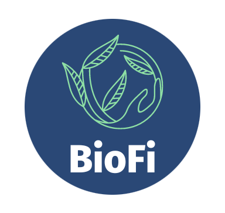

<!--
      The BioFI Project
-->

<!-- PROJECT LOGO -->
 

  

<h3 align="center">BioFi</h3>

  

    BioFi aims to incentivize and help the user reduce the time spent on screens while being able to prove it.
    With a playful aspect ( quests / tokenomics / nfts) and real utilities (certified proof of time reduction with Verifiable Credentials) we believe this project can be a game changer.
  

<!-- TABLE OF CONTENTS -->

  
Table of Contents

  <ol>
    <li>
      <a href="#about-the-project">About The Project</a>
      <ul>
        <li><a href="#built-with">Built With</a></li>
      </ul>
    </li>
    <li>
      <a href="#getting-started">Getting Started</a>
      <ul>
        <li><a href="#prerequisites">Prerequisites</a></li>
      </ul>
    </li>
    <li><a href="#usage">Usage</a></li>
    <li><a href="#team">The team</a></li>
  </ol>

<!-- ABOUT THE PROJECT -->
## What are the core functionalities of BioFi.
 
With BioFi : 

- The user can login with is favorite web3 wallet directly from his phone (done).
- The user can mint a cute nft directly from the app (done).
- The user can launch a time reduction activity (done).
- The user can retrieve a Verifiable Credential after having successfully completed the activity (we are actively working on that).
- The user can receive tokens after having completed the activity(done on the web3 part).
- The user can update it's NFT with new attributes (not yet).
- The user can receive tokens if he spends less time in average than other users (ideation phase).

(<a href="#top">back to top</a>)

### Built With

Backend :
    * [Mongoose](https://mongoosejs.com/docs/)
    * [NodeJs](https://nodejs.org/en/docs/)
    * [Express](https://expressjs.com/en/starter/)

FrontEnd :
    * [React Native](https://reactnative.dev/docs/getting-started)
    * [Typescript](https://www.typescriptlang.org/docs/)
    * [Expo](https://docs.expo.dev/)

Blockchain
    * [Hardhat](https://hardhat.org)
    * [Solidity](https://docs.soliditylang.org/en/v0.8.15/)
    * [NFT.storage](https://nft.storage)

(<a href="#top">back to top</a>)

<!-- GETTING STARTED -->
## Getting Started

To get started with this project, first install node modules with 'yarn install'
To launch do 'yarn start'

### Prerequisites

You need the Expo Go application on IOS or Android 

Go to your Phone Camera and scan the QR code showed after the command 'yarn start' on your terminal

<!-- The team -->
## The team

Serhat Akar : https://www.linkedin.com/in/serhat-akar/

Lorenzo Pasquier Flaud : https://www.linkedin.com/in/lorenzo-pasquier-flaud/

Benoît Tabry : https://www.linkedin.com/in/benoit-tabry/

(<a href="#top">back to top</a>)

